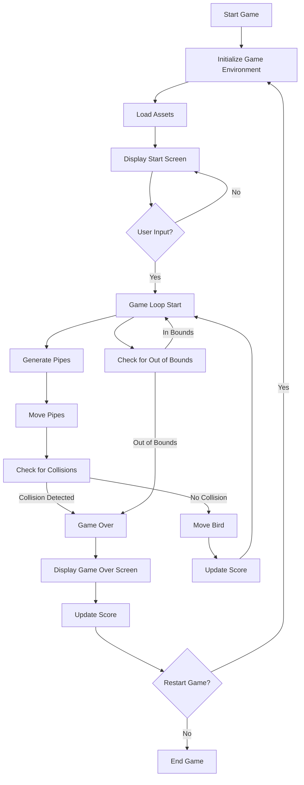

# mermaid-demo-readme

```mermaid
flowchart TD
    A[Start Game] --> B[Initialize Game Environment]
    B --> C[Load Assets]
    C --> D[Display Start Screen]
    D --> E{User Input?}
    E -- "No" --> D
    E -- "Yes" --> F[Game Loop Start]
    
    F --> G[Generate Pipes]
    G --> H[Move Pipes]
    H --> I[Check for Collisions]
    
    I -- "Collision Detected" --> J[Game Over]
    J --> K[Display Game Over Screen]
    K --> L[Update Score]
    L --> M{Restart Game?}
    M -- "Yes" --> B
    M -- "No" --> N[End Game]

    I -- "No Collision" --> O[Move Bird]
    O --> P[Update Score]
    P --> F

    F --> Q[Check for Out of Bounds]
    Q -- "Out of Bounds" --> J
    Q -- "In Bounds" --> F
```
